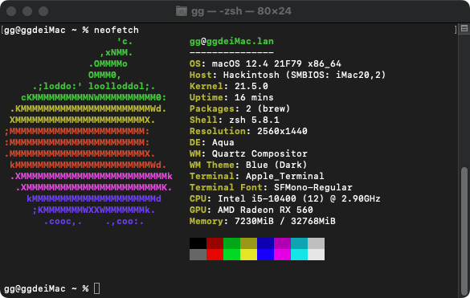

## i7 10700 + ASUS ROG STRIX B460-I GAMING 核显 独显 Hackintosh EFI

- OpenCore引导macOS 10.15.6 (支持bigsur，本人在10.15.6一路升级到11.3.1无任何问题) && Mint20 && win10

---

### 电脑配置

| 规格     | 详细信息                                     |
| -------- | ---------------------------------------- |
| 主板型号 | Asus ROG Strix B460-I             |
| 处理器   | Intel Core i7 10700           |
| 内存     | Asgard 32GB 2x16GB DDR4 2666Mhz                 |
| 硬盘     | WDS500G3X0C-00SJG0 512GB M.2 NVMe                  |
| 显卡 | ASRock Radeon RX 5500 XT Challenger ITX 8G 1717MHz 8GHz GDDR6                            |
| 显示器   | Q2490W1  |
| 声卡     | Realtek ALCS1220A (Layout 7)                    |
| 网卡&蓝牙     | DW1560 + NGFF M.2 Adapter                             |
| 板载网卡 | Intel® i219-V 1Gb Ethernet |
---

### BIOS设置

**关闭：**
- Fast Boot
- VT-d
- CSM
- Intel SGX
- CFG Lock (主板没有这个选项不用设置)

**开启：**
- VT-x
- Above 4G decoding
- Hyper-Threading
- Execute Disable Bit
- EHCI/XHCI Hand-off
- OS type: Windows 8.1/10 UEFI Mode
- DVMT Pre-Allocated (iGPU Memory): 64MB

---

### 完美程度
- 核显加速，显存1536MB；华擎5500XT ITX补全缓冲帧 显卡优化
- 睡眠正常（睡眠一晚上依旧可唤醒，笔者没遇到过 _BUG_，用阿斯加特内存睡眠久了会沙雕，会出现频繁死机 _BUG_ ，重装跟换系统无解，最终是发现内存过热导致黑苹果检测关机）
- _CPU_ 睿频正常，单核4.8，全核4.6
- 传感器正常工作、_CPU_ 温度、_SSD_ 温度风扇转速均可获取（通过iStat Menus查看）
- 定制USB映射正常（_USB2.0_  _TYPE-C_ 音频口不可识别（可以识别U盘），其他音频口正常，不过有3.5耳机和显示器扬声器，无所谓；
  USB3.2Gen2x2未测试，没有这么高的设备，不过是系统识别出单独走线，符合官方描述，应该可达到20Gbps）
- 有线网正常工作
- 驱动 _DW1560 WIFI_ ，蓝牙正常
- 4k@60显示器输出正常，内建识别，亮度及音量可通过 _MonitorControl_ 控制

---

### 具体不详细介绍，说一些细节
- 记得修改platforminfo里面的串号，以免不能登陆app store
- 显示器输出支持HDMI DP 核显独显都支持
- 若有bug并且可以修复，记得提Pr

---

### 制作不易，有能力能顺手给我点一下star再好不过
